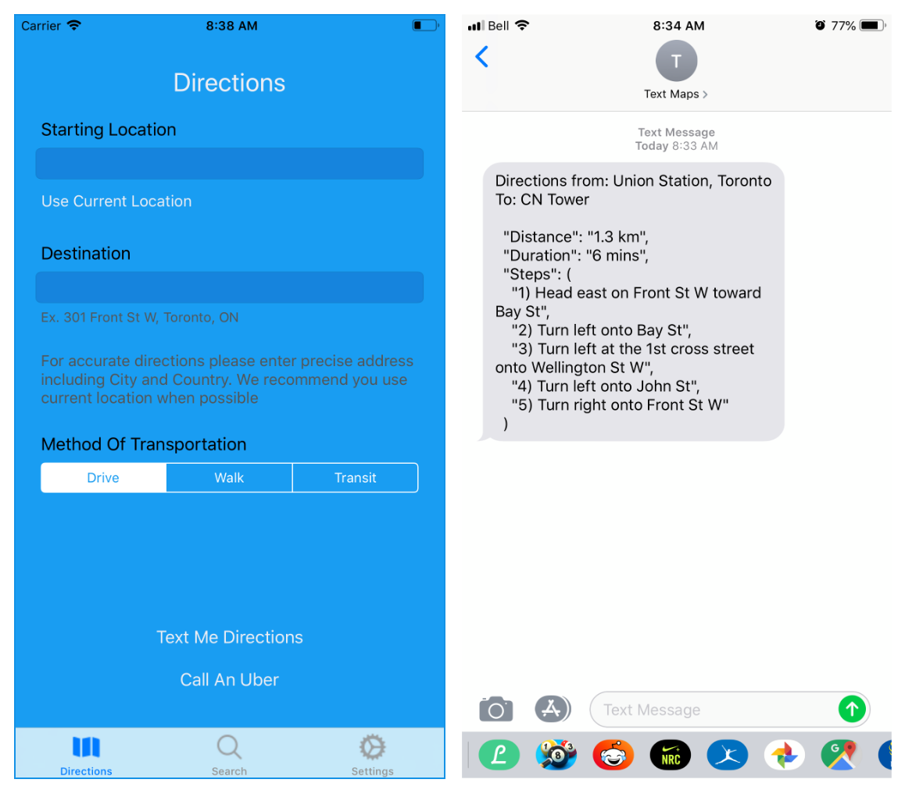

# TextMaps
Running low on Data or headed outside your coverage?\n
Textmaps is an IOS App that will send your phone directions via SMS.

Textmaps utilizes the Google Maps API to ensure users get the most updated and fast directions to any location.
The backend uses STDLIB and Node.js which runs as a serverless application while accessing various API's. 

TextMaps API - https://stdlib.com/@sagar/lib/textmaps/ \n
*Insert your own Google and Stdlib API Keys*

</p

**Features Upcoming**
- Handle Toll Routes
- Search for Points of Interest using the Google Maps API
- Limit Requests - Save Compute Time 
